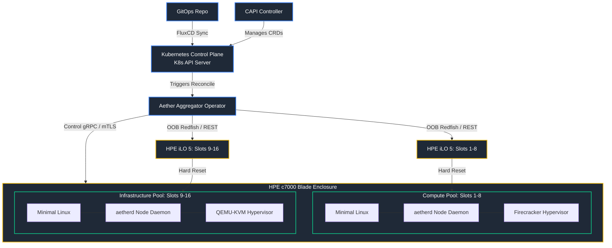
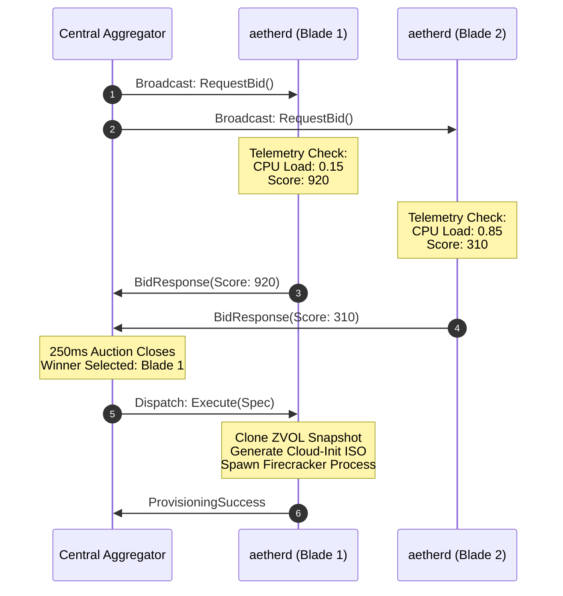

# Project Aether: Detailed System Architecture

This document describes the concrete system architecture and design patterns for Project Aether's first iteration. The implementation focuses on standardizing on a **Pure Linux substrate**, utilizing **Firecracker microVMs** for the Compute Pool and **QEMU-KVM** for the Storage/Infrastructure Pool.

---

## 1. System Component Overview

Aether is composed of four principal compiled Rust modules, designed to maintain a near-zero memory footprint and avoid heavy database dependencies.



### A. Aether Aggregator (`aether-aggregator`)
The central coordinator of the cluster, running as a stateless Rust-based Kubernetes Operator. 
*   **GitOps Reconciliation:** Watches Kubernetes Custom Resource Definitions (CRDs) like `AetherTenant` and `AetherVirtualDeployment` applied via FluxCD.
*   **Stateless State Machine:** Retains a thread-safe in-memory state table (`NodeRegistry` and `WorkloadPlacement`) protected by `tokio::sync::RwLock`.
*   **Auction Coordinator:** dispatches reverse-bid requests to blade daemons, collects scores, executes deterministic tie-breakers, and issues provisioning directives.
*   **HA Monitor:** Continuously pings worker nodes. If a node fails heartbeats, it invokes `aether-fence` before re-initiating auctions for orphaned virtual machines.

### B. Aether Node Daemon (`aetherd`)
The local agent compiled as a single zero-dependency Rust binary, running as a systemd service on every bare-metal blade node.
*   **Telemetry Monitor:** Queries CPU congestion (`/proc/loadavg`), memory usage (`/proc/meminfo`), memory channel bandwidth telemetry, and local NVMe storage health via S.M.A.R.T. APIs.
*   **Auction Respondent:** Listens for gRPC bid requests, calculates the node's local efficiency score, and submits bids back to the Aggregator.
*   **Hypervisor Provisioner:** Clones local backing volumes, compiles a custom `NoCloud` Cloud-Init ISO on the fly, configures virtual networking bridges, and spawns the VM:
    *   **On Compute Nodes:** Spawns minimalist Firecracker microVM processes.
    *   **On Storage/Infra Nodes:** Spawns full QEMU-KVM VM processes.

### C. Aether Authentication & Attestation (`aether-auth`)
A shared security library compiled into both the Aggregator and `aetherd`.
*   **mTLS Layer:** Enforces Mutual TLS (mTLS) with RSA-4096 certificates on all gRPC loops, ensuring that only trusted physical blades can communicate.
*   **Handshake Tokens:** Generates and validates cryptographically signed, single-use ephemeral tokens to attest node identity before workload deployments.

### D. Aether Fencing Controller (`aether-fence`)
The Out-of-Band (OOB) hardware power execution plane.
*   **Fencing Enforcement:** Invoked by the Aggregator's recovery loop to execute hard power fencing (STONITH - Shoot The Other Node In The Head) via the HPE iLO 5 Redfish REST API.
*   **Deterministic Safety:** Guarantees a rogue or partitioned node is completely shut down before its database volumes are cloned or its virtual machines are re-auctioned, avoiding file system corruption.

### E. Pact Mock Server (`pact-mock-server`)
A vendor-modularized standalone mock server simulating physical chassis backplanes and REST APIs (like HPE OneView).
*   **Vendor Isolation:** Modular architecture isolating vendor-specific endpoints and behaviors in independent submodules (e.g. `crates/pact-mock-server/src/hpe_oneview.rs`).
*   **Contract Testing:** Serves as the target mock provider for the Aggregator's midplane network driver client (`VirtualConnectClient`). Validates connection state tracking, token refreshes, and asynchronous task state polling under safe, local environments.

---

## 2. Dynamic Control & Data Flow

### The Reverse-Bidding & Provisioning Sequence


---

## 3. Storage & Network Integration

### Storage Substrate (ZFS on Linux & CSI Integration)
To deliver high-performance persistent storage:
*   Storage nodes (Slots 9-16) run **ZFS on Linux (ZoL)**.
*   Templates are stored as base read-only ZFS snapshots.
*   VM disks are created instantaneously as thin-provisioned **ZVOLs** cloned from base templates.
*   **Kubernetes CSI Integration (Production - Network-Attached iSCSI):** Kubernetes running inside guest compute microVMs provisions storage via **`democratic-csi`** configured with the `zfs-generic-iscsi` driver. To maintain strict decoupling and reliability, volume claims are *never* mounted from the local blade running the VM. Instead:
    1. The Aether Aggregator commands `aetherd` on the designated Storage Blade to cut the zvol and export it as an iSCSI target using the Linux SCSI Target framework (LIO).
    2. The Compute Blade host OS acts as an iSCSI initiator, logging into the Storage Blade's iSCSI target portal over the high-speed **VLAN 11 (Storage Fabric)**.
    3. The Compute Blade maps the iSCSI target locally as a block device (e.g., `/dev/sdX`) and maps `/dev/sdX` directly down into Firecracker's `virtio-blk` drive interface or QEMU-KVM's disk configuration.
*   **Storage Network Configuration (VLAN 11):** All iSCSI traffic is isolated on a dedicated high-bandwidth **VLAN 11 (Storage Fabric)** over the HPE Virtual Connect 10Gb midplane fabric. Both Compute and Storage blade network interfaces for VLAN 11 must be configured with Jumbo Frames (**MTU 9000**) to optimize SCSI command processing, reduce CPU overhead, and maximize throughput.
*   **CSI Driver Mocking & Conformance (Test):** The aggregator includes a custom **`AetherCsiDriver`** (`crates/aether-aggregator/src/storage/csi.rs`) implementing the standard gRPC CSI v1.x service. In test and CI environments, this component acts as a high-fidelity mock, staging and publishing block capability requests as regular files and filesystem capability requests as directories, simulating network-attached block mappings without requiring live iSCSI targets or `democratic-csi` deployments.

#### Kubernetes StorageClass Configuration Spec (Production)
The GitOps configuration for the storage provisioner standardizes on `org.democratic-csi.zfs-generic-iscsi`:

```yaml
apiVersion: storage.k8s.io/v1
kind: StorageClass
metadata:
  name: aether-zfs-iscsi
provisioner: org.democratic-csi.zfs-generic-iscsi
reclaimPolicy: Delete
volumeBindingMode: Immediate
parameters:
  # Instructs democratic-csi to provision ZVOLs instead of datasets
  detachedVolumes: "true"
  zfsZpool: "zroot"
  zfsDatasetParent: "zroot/kube-storage"
  zfsBlocksize: "128K"
  zfsEnableCompression: "true"
  zfsCompression: "lz4"
  zfsThinProvision: "true"
  fsType: "ext4"
  
  # iSCSI Network Target & Initiator mapping settings
  iscsi:
    # Portal points to the storage blade target IP on VLAN 11 storage network
    portal: "10.11.0.10:3260"
    targetGroups:
      - name: default
        tpgt: 1
    discovery:
      auth:
        type: None
    session:
      auth:
        type: None
```

### Network Tagging (HPE Virtual Connect)
*   **VLAN 10 (Control Bus):** Directs private control plane traffic, isolated in hardware via HPE Virtual Connect Flex-10 MLAG.
*   **VLAN 999 (OOB Management):** Isolated management network connecting the Aggregator to HPE iLO 5 backplanes.
*   **VLAN 20+ (Tenant Bridges):** Logical tenant traffic is segregated into discrete VLAN tags and bridged directly to VM virtual network cards via host Linux bridges (`br-tenant`).

---

## 4. Multi-Vendor Hardware Abstraction Layer (HAL)

To prevent locking Project Aether into a single vendor's ecosystem, Aether abstracts all chassis-level management (power management, fencing, and midplane network tagging) behind a pluggable Hardware Abstraction Layer (HAL). This ensures that while our initial acquisition targets HPE BladeSystem c7000 enclosures, the control loops can seamlessly scale to support Dell PowerEdge, IBM/Lenovo Flex, or other systems in the future.

```
                    ┌──────────────────────────────────────┐
                    │          aether-aggregator           │
                    └──────────────────┬───────────────────┘
                                       │
            ┌──────────────────────────┴──────────────────────────┐
            ▼                                                     ▼
┌───────────────────────┐                             ┌───────────────────────┐
│     ChassisManager    │                             │ MidplaneNetworkManager│
│        (Trait)        │                             │        (Trait)        │
└───────────┬───────────┘                             └───────────┬───────────┘
            │                                                     │
 ┌──────────┼──────────┐                               ┌──────────┼──────────┐
 ▼          ▼          ▼                               ▼          ▼          ▼
HPE-iLO   Dell-iDRAC Generic-Redfish               HPE-VC    Dell-SmartFab  IBM-Flex
```

### A. Out-of-Band Power & Fencing Trait (`aether-fence`)
Power operations and fencing safety routines (STONITH) interact with chassis controllers through the `ChassisManager` Rust trait:

```rust
#[async_trait]
pub trait ChassisManager: Send + Sync {
    /// Perform a hard reset or power shutdown on a specific blade slot.
    async fn power_off(&self, slot: u8) -> Result<(), FencingError>;
    
    /// Boot or power up a specific blade slot.
    async fn power_on(&self, slot: u8) -> Result<(), FencingError>;
    
    /// Query the current state of a slot (e.g., PoweredOn, PoweredOff, Unknown).
    async fn get_power_status(&self, slot: u8) -> Result<PowerStatus, FencingError>;
}
```

#### Driver Implementations:
*   **`HpeIloProvider` (Initial Support):** Targets HPE iLO 5 controllers utilizing the DMTF Redfish API schema for power state control.
*   **`DellIdracProvider` (Roadmap):** Targets Dell iDRAC (Integrated Dell Remote Access Controller) Redfish endpoints for PowerEdge MX7000 or FX2 chassis.
*   **`GenericRedfishProvider` (Roadmap):** A fallback driver conforming strictly to baseline DMTF Redfish standard schemas, compatible with any Redfish-compliant BMC.

---

### B. Midplane Network Configuration Trait
Configuring VLAN tagging on the midplane switch fabric is handled by the `MidplaneNetworkManager` trait:

```rust
#[async_trait]
pub trait MidplaneNetworkManager: Send + Sync {
    /// Bind a tenant VLAN tag to a specific blade slot's midplane fabric interface.
    async fn provision_vlan_interface(&self, slot: u8, vlan_id: u16) -> Result<(), NetworkError>;
    
    /// Unbind a tenant VLAN tag from a specific blade slot's midplane fabric.
    async fn teardown_vlan_interface(&self, slot: u8, vlan_id: u16) -> Result<(), NetworkError>;
}
```

#### Driver Implementations:
*   **`HpeVirtualConnectProvider` (Initial Support):** Orchestrates HPE Virtual Connect modules via REST or SOAP endpoints to tag/untag VLAN profiles on FlexNICs.
*   **`DellSmartFabricProvider` (Roadmap):** Orchestrates Dell PowerEdge MX I/O Modules using Dell SmartFabric Services (SFS) API.
*   **`LenovoFlexProvider` (Roadmap):** Orchestrates Lenovo Flex System switches via SSH/REST CLI wrappers.

---

## 5. Cluster API (CAPI) Compatibility Layer

To enable Aether to serve as a target for Kubernetes Cluster API installations (via a future `cluster-api-provider-aether`), Aether implements a Kubernetes-native compatibility layer:
*   **Declarative CRD Control:** The CAPI Infrastructure Machine controller provisions node VMs by creating and managing standard `AetherVirtualDeployment` CRDs rather than interacting directly with hypervisor endpoints.
*   **Dynamic Cloud-Init Injection:** Aether dynamically consumes bootstrap secret configurations (e.g., Kubeadm scripts) via the `userDataSecretRef` field, delivering them to guest VMs using local Firecracker MMDS services or generated NoCloud seed ISO drives.
*   **Failure Domains Expose:** Blade slots and chassis pools are exposed as native `FailureDomains` inside the cluster status, allowing CAPI to distribute control plane and worker nodes across separate physical blades.

For detailed specification contracts, schemas, and bootstrapping pipelines, refer to [capi_compatibility.md](file:///Users/casibbald/Workspace/remote/microscaler/Aether/docs/architecture/capi_compatibility.md).

---

## 6. Architectural Guidelines & Decisions

1.  **Low footprint:** The local node daemon `aetherd` must run with a target memory resident set size (RSS) of `<15MB`, ensuring maximum CPU/RAM is allocated to tenant workloads.
2.  **No Nested Virtualization:** Firecracker workloads must always be assigned to Compute blades running bare metal Linux, bypassing nested virtualization traps.
3.  **Out-of-band Attestation:** Nodes must authenticate via OOB hardware-attested paths to prevent hypervisor escapes from capturing cluster-wide control tokens.
4.  **Vendor-Agnostic Core Logic:** Core bidding, scheduling, and failure recovery pipelines in the central aggregator must never interact directly with concrete vendor endpoints; they must interact exclusively with the `ChassisManager` and `MidplaneNetworkManager` trait structures.
5.  **CAPI Provider Decoupling:** The future Cluster API provider must interact only via the Kubernetes Custom Resource Definitions (CRDs) reconciled by the central Aggregator, avoiding direct gRPC or OOB connections to physical blades.
