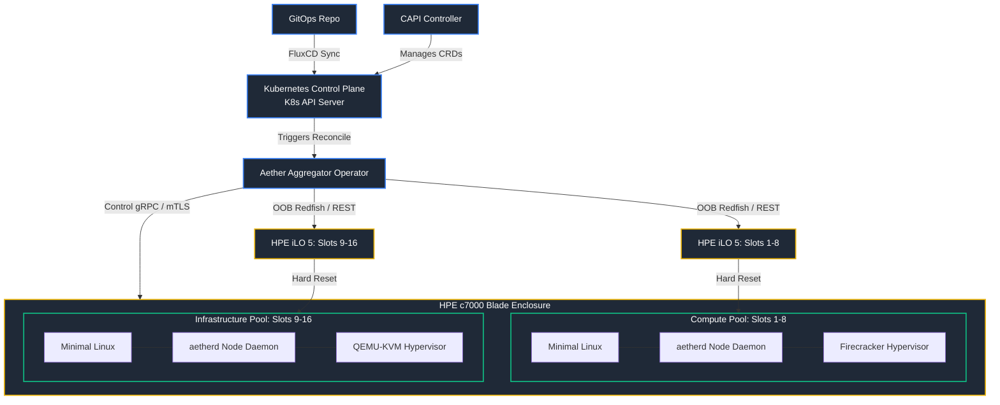
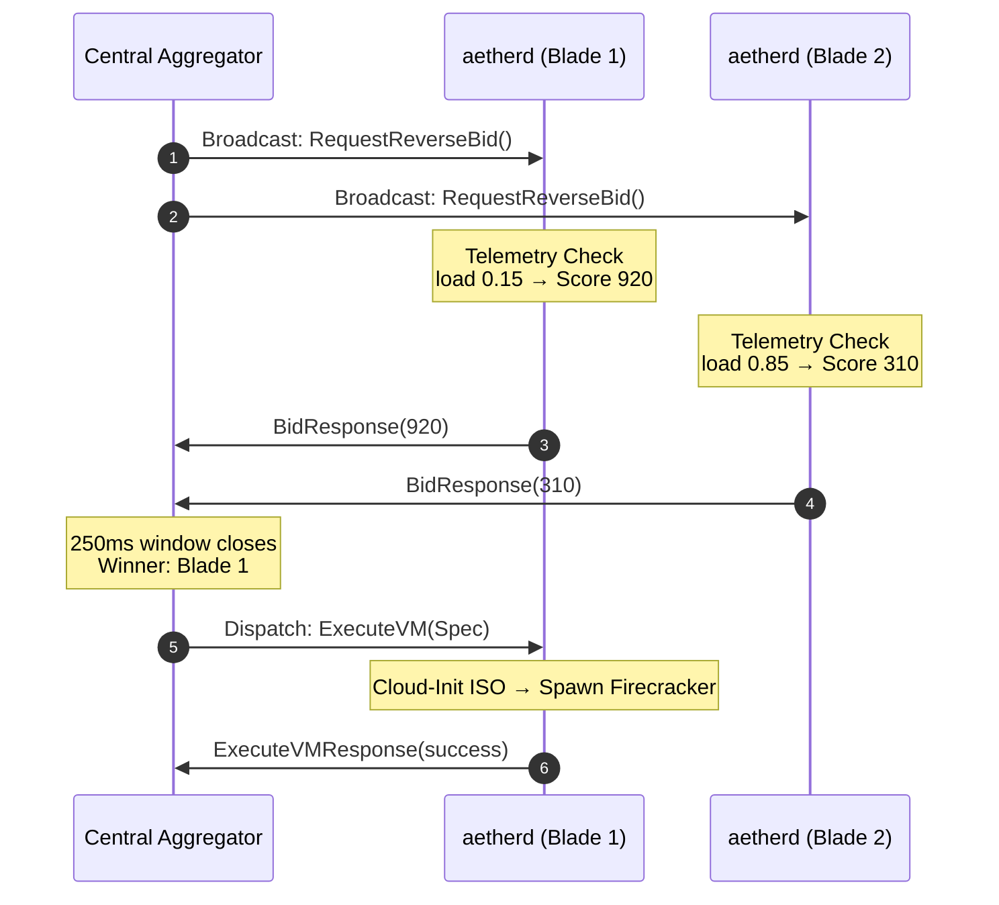

# Project Aether: System Architecture

This document is the technical hub for Aether's architecture. It gives the
system-level model — components, control/data flow, concurrency, security posture,
and hardware abstraction — and links out to per-subsystem **implementation
references** that go down to real signatures, constants, and `file:line` citations.

Aether standardizes on a **Pure Linux substrate**: **Firecracker microVMs** for the
Compute Pool and **QEMU-KVM** for the Storage/Infrastructure Pool, coordinated by a
stateless, decentralized control plane written in Rust.

> **How to read this doc.** Sections 1–7 describe the intended architecture and are
> stable. Where the current build differs from the design, you'll see an
> **Implementation reality** note and a pointer to the relevant deep-dive. The
> [Maturity Matrix](#8-implementation-maturity-matrix) summarizes what is
> implemented and tested versus stubbed or planned as of the latest audit.

## Deep-dive index

| Subsystem | Reference |
| :--- | :--- |
| Reverse-bidding, scoring, tie-breaker, registry/heartbeat | [impl_bidding_scheduling.md](./docs/architecture/impl_bidding_scheduling.md) |
| Hypervisor drivers, QMP, Cloud-Init, VM lifecycle | [impl_hypervisor_lifecycle.md](./docs/architecture/impl_hypervisor_lifecycle.md) |
| ZFS/ZVOL, iSCSI, CSI, live migration | [impl_storage_migration.md](./docs/architecture/impl_storage_migration.md) |
| mTLS, attestation, full gRPC protocol, networking, concurrency | [impl_security_protocol.md](./docs/architecture/impl_security_protocol.md) |

Design/spec companions (intended state, not code-derived): [live_migration.md](./docs/architecture/live_migration.md),
[capi_compatibility.md](./docs/architecture/capi_compatibility.md),
[production_readiness.md](./docs/architecture/production_readiness.md),
[flintlock_contracts.md](./docs/architecture/flintlock_contracts.md).

---

## 1. System Component Overview

Aether is a Cargo workspace of five crates designed for a near-zero memory
footprint and no heavy database dependencies.



### Crate map

| Crate | Role | Key modules |
| :--- | :--- | :--- |
| `aether-aggregator` | Stateless K8s operator & auction coordinator | `scheduler`, `registry`, `tie_breaker`, `storage/csi`, `network/hpe_vc` |
| `aetherd` | Per-blade node daemon | `bidder`, `telemetry`, `hypervisor/{firecracker,qemu}`, `storage/{zfs,iscsi}`, `migration/*`, `network/bridge`, `cloud_init`, `vsock` |
| `aether-auth` | Shared mTLS + attestation, generated proto bindings | `mtls`, `token`, `lib` (`include_proto!`) |
| `aether-fence` | OOB STONITH via Redfish | *(planned — near-empty stub today)* |
| `pact-mock-server` | Hardware mock (HPE OneView) for contract tests | `hpe_oneview`, `bin/oneview` |

### A. Aether Aggregator (`aether-aggregator`)
Stateless Rust Kubernetes Operator and central coordinator.
*   **GitOps reconciliation:** watches CRDs (`AetherTenant`, `AetherVirtualDeployment`) applied by FluxCD.
*   **Soft state:** in-memory `NodeRegistry` + placement tables under `tokio::sync::RwLock`.
*   **Auction coordinator:** broadcasts reverse-bid requests, collects scores, runs the deterministic tie-breaker, issues provisioning directives. → [bidding deep-dive](./docs/architecture/impl_bidding_scheduling.md).
*   **HA monitor:** prunes nodes that miss heartbeats and (by design) invokes `aether-fence` before re-auctioning orphaned VMs.

### B. Aether Node Daemon (`aetherd`)
Single zero-dependency binary, one per blade, run as a systemd service.
*   **Telemetry:** `/proc/loadavg`, `/proc/meminfo`, `statvfs`, NVMe S.M.A.R.T.
*   **Auction respondent:** scores local telemetry and returns a bid.
*   **Provisioner:** builds a NoCloud Cloud-Init ISO, configures networking, and spawns Firecracker (compute) or QEMU-KVM (infra). → [hypervisor deep-dive](./docs/architecture/impl_hypervisor_lifecycle.md).

> **Implementation reality.** Backend selection is currently a per-request
> threshold (`cpu_limit < 4` ⇒ Firecracker) rather than a blade-role/CRD-profile
> field. See the hypervisor deep-dive §1.

### C. Auth & Attestation (`aether-auth`)
Shared security library linked into both daemons.
*   **mTLS** on all gRPC via tonic (rustls). *Implementation reality:* dev certs are **ECDSA P-256**, generated in-memory at startup; there is no production cert-file path yet.
*   **Attestation:** single-use **HMAC-SHA256** tokens with a 60 s window and replay protection. → [security deep-dive](./docs/architecture/impl_security_protocol.md).

### D. Fencing Controller (`aether-fence`)
Out-of-band power-execution plane for STONITH via the HPE iLO 5 Redfish API.
Guarantees a partitioned node is powered off before its volumes are cloned or its
VMs re-auctioned. *Implementation reality:* this crate is a near-empty stub today
(Stage 6). The `ChassisManager` trait shape is specified in §4.

### E. Pact Mock Server (`pact-mock-server`)
Vendor-modularized mock of chassis REST APIs (HPE OneView), used for contract
testing the aggregator's midplane driver. See [security deep-dive §5](./docs/architecture/impl_security_protocol.md#5-hardware-mock-pact-mock-server).

---

## 2. Dynamic Control & Data Flow

Coordination is a **star topology**: each `aetherd` holds a single mTLS gRPC
channel to the aggregator. There is **no Raft, gossip, or quorum** between blades —
placement is decided centrally from locally-computed bids, and the authoritative
desired state lives in Kubernetes CRDs (GitOps), not in a replicated log across the
blades. The only blade-to-blade traffic in the system is live migration.



The auction converges in a hard **250 ms** window (a node that misses it is simply
excluded — no retry). Winner selection filters `score > 0`, takes the maximum, and
breaks ties deterministically. Full scoring formula, tie-breaker tiers, and the
registry/heartbeat state machine are in the
[bidding deep-dive](./docs/architecture/impl_bidding_scheduling.md).

---

## 3. Storage & Network Integration

### Storage substrate (ZFS on Linux + CSI)
Storage blades run **ZFS on Linux**; VM disks are thin, copy-on-write **ZVOL**
clones of read-only base snapshots. For Kubernetes persistent volumes, Aether
targets `democratic-csi` (`zfs-generic-iscsi`) with strict compute/storage
decoupling: the storage blade cuts a ZVOL and exports it as an **iSCSI target
(LIO)**; the compute blade logs in as an **initiator** over the storage fabric and
maps the device into the guest.

> **Implementation reality.** Today the `aetherd` side implements the **iSCSI
> initiator** and the ZFS ZVOL operations (via native `zfs_core` bindings), while
> the aggregator ships an **in-memory CSI mock**. The iSCSI **target/LIO export**
> and the production ZVOL flags (lz4, thin) are not yet wired. See the
> [storage & migration deep-dive](./docs/architecture/impl_storage_migration.md).

#### Kubernetes StorageClass (production target)

```yaml
apiVersion: storage.k8s.io/v1
kind: StorageClass
metadata:
  name: aether-zfs-iscsi
provisioner: org.democratic-csi.zfs-generic-iscsi
reclaimPolicy: Delete
volumeBindingMode: Immediate
parameters:
  detachedVolumes: "true"
  zfsZpool: "zroot"
  zfsDatasetParent: "zroot/kube-storage"
  zfsBlocksize: "128K"
  zfsEnableCompression: "true"
  zfsCompression: "lz4"
  zfsThinProvision: "true"
  fsType: "ext4"
  iscsi:
    portal: "10.11.0.10:3260"
    targetGroups:
      - name: default
        tpgt: 1
    discovery: { auth: { type: None } }
    session:   { auth: { type: None } }
```

### Network tagging & VLANs
*   **VLAN 10 — Control Bus:** private control-plane traffic (HPE Virtual Connect Flex-10 MLAG).
*   **VLAN 11 — Storage Fabric:** all iSCSI traffic, **Jumbo Frames (MTU 9000)**.
*   **VLAN 999 — OOB Management:** aggregator ↔ iLO 5.
*   **VLAN 20+ — Tenant Bridges:** per-tenant VLANs bridged to guest NICs.

> **Implementation reality.** `aetherd`'s `RealBridgeManager` programs tenant
> bridges, L2 TAP devices, and MAC anti-spoofing using **netlink (`rtnetlink`),
> `tun-rs`, and nftables (`rustables`)** directly — not `ip`/`brctl`/`ebtables`.
> Details in the [security deep-dive §4](./docs/architecture/impl_security_protocol.md#4-networking).

---

## 4. Multi-Vendor Hardware Abstraction Layer (HAL)

Chassis-level concerns (power/fencing, midplane VLAN tagging) sit behind pluggable
traits so Aether is not locked to HPE.

```
                    ┌──────────────────────────────────────┐
                    │          aether-aggregator           │
                    └──────────────────┬───────────────────┘
            ┌──────────────────────────┴──────────────────────────┐
            ▼                                                     ▼
┌───────────────────────┐                             ┌───────────────────────┐
│     ChassisManager    │                             │ MidplaneNetworkManager│
│        (Trait)        │                             │        (Trait)        │
└───────────┬───────────┘                             └───────────┬───────────┘
 ┌──────────┼──────────┐                               ┌──────────┼──────────┐
 ▼          ▼          ▼                               ▼          ▼          ▼
HPE-iLO   Dell-iDRAC Generic-Redfish               HPE-VC    Dell-SmartFab  IBM-Flex
```

### A. Chassis / fencing trait (`aether-fence`)

```rust
#[async_trait]
pub trait ChassisManager: Send + Sync {
    async fn power_off(&self, slot: u8) -> Result<(), FencingError>;
    async fn power_on(&self, slot: u8) -> Result<(), FencingError>;
    async fn get_power_status(&self, slot: u8) -> Result<PowerStatus, FencingError>;
}
```

Drivers: `HpeIloProvider` (initial), `DellIdracProvider`, `GenericRedfishProvider`
(roadmap). *Implementation reality:* the `aether-fence` crate is a stub — this trait
is a specified interface, not yet implemented (Stage 6).

### B. Midplane network trait (`MidplaneNetworkManager`)

```rust
#[async_trait]
pub trait MidplaneNetworkManager: Send + Sync {
    async fn provision_vlan_interface(&self, slot: u8, vlan_id: u16) -> Result<(), NetworkError>;
    async fn teardown_vlan_interface(&self, slot: u8, vlan_id: u16) -> Result<(), NetworkError>;
}
```

Implemented driver: `VirtualConnectClient` (HPE OneView REST/JSON, session-token
auth, async task polling). Roadmap: `DellSmartFabricProvider`, `LenovoFlexProvider`.
Details in the [security deep-dive §4b](./docs/architecture/impl_security_protocol.md#4b-hpe-virtual-connect-client-aether-aggregatorsrcnetworkhpe_vcrs).

---

## 5. Concurrency & Error Model

- **Runtime:** `tokio` everywhere; gRPC via `tonic`; trait objects via `async_trait`.
- **Shared state:** guarded by `tokio::sync::RwLock`/`Mutex` (node registry, active
  VM map, migration sets, QMP sockets). The single exception is the token replay
  set, which uses a synchronous `parking_lot::Mutex` for its short critical section.
- **Concurrency pattern:** the auction fans out one `tokio` task per node into a
  `JoinSet`, each bounded by the 250 ms window; results are drained as they arrive.
- **Errors:** no crate-wide `Result` alias. The aggregator defines a `thiserror`
  `NetworkError`; elsewhere code uses `io::Result<T>` or `Result<_, String>`.
  At the gRPC boundary, internal errors map to `tonic::Status`
  (`unauthenticated`, `internal`, `invalid_argument`, `not_found`, `unimplemented`).

Full breakdown in the [security & protocol reference §6](./docs/architecture/impl_security_protocol.md#6-concurrency--error-model).

---

## 6. Cluster API (CAPI) Compatibility

Aether is designed to be a CAPI infrastructure target via a future
`cluster-api-provider-aether`: the machine controller creates
`AetherVirtualDeployment` CRDs instead of calling hypervisors directly; bootstrap
data is injected via `userDataSecretRef` → Cloud-Init; and blade slots are exposed
as `FailureDomains`. Contracts in
[capi_compatibility.md](./docs/architecture/capi_compatibility.md). *(Stage 9 —
planned.)*

---

## 7. Live Migration & Auto-Convergence

Live relocation targets the Infrastructure Pool (QEMU-KVM), driven over QMP:
three-phase pre-copy memory transfer, NBD `drive-mirror` for local disks, and
QEMU-native **auto-converge** for write-heavy guests. The `Bidder` applies a **15 %
score penalty per active migration** to prevent oversaturation.

> **Implementation reality.** The migration socket + mTLS + HMAC-attestation layer
> is the most complete data-plane component; the memory/block/converge modules are
> thin QMP wrappers (no custom throttle, no timeout/rollback yet). Full state
> machine, framing, and constants in the
> [storage & migration deep-dive §5](./docs/architecture/impl_storage_migration.md#5-live-migration-state-machine)
> and the design spec [live_migration.md](./docs/architecture/live_migration.md).

---

## 8. Implementation Maturity Matrix

Snapshot as of the Epics 1–5 audit (`docs/EPICS/audit_dev_1to5.md`; 152 passing
tests across four crates, ~87 % line coverage). "Tested" = has unit/integration
coverage; "Real, untested" = production code path without tests; "Mock/stub" =
placeholder or in-memory simulation; "Planned" = not yet built.

| Subsystem | Status |
| :--- | :--- |
| mTLS transport + attestation tokens | ✅ Tested (dev PKI only; no prod cert path, no rotation) |
| Reverse-bid scoring & rejection | ✅ Tested (healthy-score value & penalty gradients untested) |
| Tie-breaker (3 tiers) | ✅ Tested |
| Node registry + heartbeat/pruning | ✅ Tested |
| Auction broadcast / 250 ms convergence | ✅ Tested (against mock scorers) |
| Firecracker driver lifecycle | ✅ Tested (mock process; real boot unverified) |
| QEMU driver + QMP client | 🟨 Partial (mock QMP; arg vector untested) |
| Cloud-Init ISO generation | ✅ Tested — but **ISO not mounted into the VM yet** |
| VSOCK (UDS multiplexer + mTLS) | ✅ Tested |
| iSCSI **initiator** | ✅ Tested |
| iSCSI **target / LIO export** | ⛔ Planned |
| ZFS ZVOL manager | 🟧 Real, untested (no lz4/thin flags) |
| CSI driver | 🟨 Tested **mock** (in-memory; snapshots/expand unimplemented) |
| Tenant bridge (netlink/nftables) | 🟧 Real, untested (coverage-excluded cfg) |
| HPE Virtual Connect client | ✅ Contract-tested (not real hardware) |
| Migration socket + attestation | ✅ Tested (most complete migration piece) |
| Memory / block / auto-converge | 🟧 Thin QMP wrappers, untested |
| OOB fencing (`aether-fence`) | ⛔ Planned (Stage 6) |
| Multi-vendor HAL drivers | ⛔ Planned (Stage 8) |
| CAPI provider | ⛔ Planned (Stage 9) |

For per-item detail and `file:line` evidence, follow the deep-dive links above.
Roadmap staging is tracked in the [README](./README.md#delivery-stages--product-roadmap).
