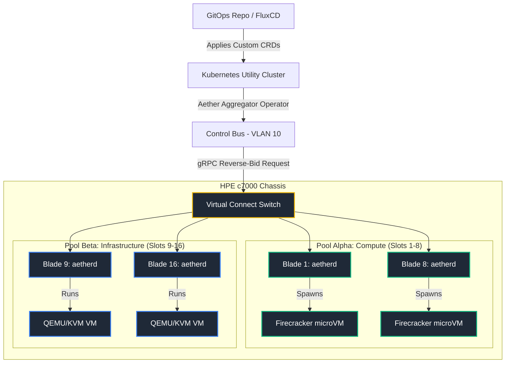
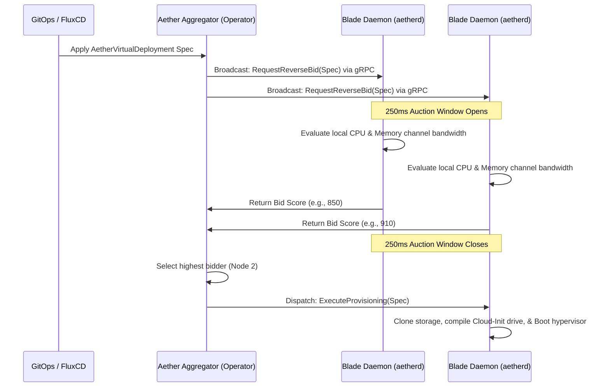

# Project Aether: Autonomous, Decentralized Multi-Tenant Compute Plane

[](https://opensource.org/licenses/Apache-2.0)
[](https://www.rust-lang.org/)
[](https://firecracker-microvm.github.io/)

Project Aether is a zero-dependency, open-source hypervisor orchestration plane designed to transform enterprise blade chassis deployments—such as an HPE BladeSystem c7000 enclosure—into highly dense, multi-tenant private clouds. 

By eliminating complex, licensing-restrictive management frameworks (such as VMware vCenter and vSphere DRS), Aether leverages an elegant, decentralized **Reverse-Bidding Architecture** written in Rust to deliver "just enough orchestration" with sub-100ms boot performance and near-zero hypervisor overhead.

---

## 1. Core Vision & Strategic Focus

Aether standardizes entirely on a **Pure Linux substrate** using **Firecracker microVMs** (for high-density, ephemeral workloads) and **QEMU-KVM** (for long-lived, persistent databases and Kubernetes control planes). This unified approach provides full VMware replacement capabilities without the performance overhead of nested virtualization. 

### The VMware Replacement Matrix
Aether replaces heavy, stateful proprietary virtualization components with lightweight, stateless, and decentralized open-source tools:

| Legacy VMware Component | Aether Open-Source Architecture Replacement |
| :--- | :--- |
| **vCenter Server** | Stateless Kubernetes Operator synced via **FluxCD** (GitOps-driven) |
| **vSphere DRS** | Autonomous, decentralized **gRPC Reverse-Bidding** calculated locally on each blade node |
| **vSphere HA** | Out-of-band hard-power fencing (STONITH) via the **HPE iLO 5 Redfish API** |
| **vSphere Distributed Switch** | Physical partitioning via **HPE Virtual Connect Flex-10 MLAG** & native Linux bridges |
| **VMware VMFS / vSAN** | Local **ZFS on Linux (ZoL) Volumes (ZVOLs)** & thin-provisioned LVM pools |

---

## 2. Cluster Architecture

Aether splits the physical blade chassis (e.g., 16 slots, 640 CPU cores, 4TB RAM) into two logical profiles running a minimal bare-metal Linux installation:



### Profile 1: The Compute Blades (Slots 1–8)
*   **Target Workloads:** Ephemeral developer micro-environments, serverless cloud functions, and high-density multi-tenant container pods.
*   **Hypervisor Mechanics:** The Rust node daemon (`aetherd`) intercepts requests and leverages **Firecracker** to spin up secure, hardware-isolated microVMs directly onto the bare-metal kernel in under 100 milliseconds, with less than 5MB of memory overhead per instance.

### Profile 2: The Storage & Infrastructure Blades (Slots 9–16)
*   **Target Workloads:** Long-lived, persistent virtual machines, production database replicas, and Kubernetes control plane/worker nodes.
*   **Hypervisor Mechanics:** These blades run full **QEMU-KVM** configurations and leverage **ZFS on Linux (ZVOLs)** to handle block-level storage. This enables inline data compression, thin provisioning, and 0ms atomic snapshot cloning.

---

## 3. The Reverse-Bidding Loop

Instead of a centralized scheduler pushing workloads onto nodes based on a stale global database, Aether implements a decentralized, pull-based marketplace model:



1.  **Workload Intent Broadcast:** The Aether Aggregator receives a declarative workload request via GitOps and broadcasts the specification payload (CPU quotas, memory bytes, storage boundaries, tenant mappings) to all registered blade daemons over a secure gRPC channel.
2.  **Autonomous Telemetry Evaluation:** Each blade node parses the intent string and queries its local kernel parameters, evaluating CPU task congestion, memory channel bandwidth availability, and drive array wear leveling.
3.  **The Reverse-Bid Response:** Nodes compute an algorithmic score from 1 to 1000. If a node lacks resources to safely host the instance without degrading current SLAs, it returns `-1`. Healthy nodes return their score within a strict **250ms convergence window**.
4.  **Deterministic Convergence:** The Aggregator accepts the highest-value bid. If multiple nodes return identical scores, the engine drops into a multi-tier tie-breaker matrix (evaluating chassis thermal layout, adjacent slot density, and SSD smart write wear) to pick a winner deterministically. The winning node instantly clones its local volume, compiles a custom NoCloud Cloud-Init configuration drive, and boots the hypervisor.

---

## 4. Delivery Stages & Product Roadmap

Project Aether's deployment schedule is organized into incremental development stages to safely migrate off VMware infrastructure:

```
[ Stage 1: API & Proto ] ──► [ Stage 2: Auction loop ] ──► [ Stage 3: Dual Hypervisor ]
                                                                     │
┌────────────────────────────────────────────────────────────────────┘
▼
[ Stage 4: ZFS & VC HAL ] ──► [ Stage 5: Live Migration ] ──► [ Stage 6: iLO Fencing / HA ]
                                                                     │
┌────────────────────────────────────────────────────────────────────┘
▼
[ Stage 7: Dev CLI & Vsock ] ─► [ Stage 8: Multi-Vendor HAL ] ─► [ Stage 9: Cluster API (CAPI) ]
```

### 🟩 Stage 1: Core API & Rust Substrate (Active)
*   Define compile-target gRPC schemas under [aether.proto](file:///Users/casibbald/Workspace/remote/microscaler/Aether/proto/aether.proto).
*   Initialize the Rust cargo workspace directory layout (Aggregator, Daemon, Auth, Fencing).
*   Secure baseline Mutual TLS (mTLS) socket handshakes.

### 🟩 Stage 2: Stateless Reverse-Bidding & Scheduling (Active)
*   Build the in-memory `NodeRegistry` and `WorkloadPlacement` state tables in the aggregator.
*   Implement the asynchronous 250ms broadcast bidding convergence loop.
*   Establish local host telemetry check routines in `aetherd` (CPU loadavg, memory channel pressure).

### 🟦 Stage 3: Dual Hypervisor Engine (In Progress)
*   Integrate Firecracker boot loops into `aetherd` (Vsock config, serial console routing).
*   Implement KVM hypervisor management via raw QEMU command compilation.
*   Build dynamic local `NoCloud` Cloud-Init compilation in host memory (`tmpfs`).

### ░░ Stage 4: Storage Slicing & Net Tagging (Planned)
*   Integrate local **ZFS on Linux (ZVOL)** snapshot cloning routines with 0ms provisioning.
*   Integrate `democratic-csi` for K8s persistent storage allocations.
*   Implement Virtual Connect Flex-10 hardware VLAN trunk tagging.

### ░░ Stage 5: Live Migration & Auto-Convergence (Planned)
*   Build **QEMU `drive-mirror` + NBD** block replication loops inside `aetherd` for local disk migrations.
*   Implement iterative memory pre-copy routines over TCP migration sockets.
*   Build Auto-Converge vCPU throttling to guarantee migration convergence on active write loads.

### ░░ Stage 6: Out-of-Band Fencing & HA (Planned)
*   Implement the Redfish STONITH client (`aether-fence`) targeting HPE iLO 5 endpoints.
*   Build the stateless HA deadman switch loop (15s heartbeat timeout failover).
*   Implement ZFS asynchronous volume replication (`zrepl`) for Disaster Recovery (RPO 5m).

### ░░ Stage 7: Developer CLI & Guest Operations (Planned)
*   Compile the `aether` developer CLI client tool.
*   Build zero-network guest access (`aether shell` and `aether exec`) tunneling commands via QEMU Guest Agent sockets and Firecracker VSOCK.
*   Support local directory passthroughs via **VirtioFS** mounts.

### ░░ Stage 8: Multi-Vendor Hardware Abstraction (Planned)
*   Abstract `ChassisManager` and `MidplaneNetworkManager` interfaces to support Dell PowerEdge MX7000 and IBM/Lenovo Flex Chassis.

### ░░ Stage 9: Cluster API (CAPI) Integration (Planned)
*   Build a Kubernetes-native Cluster API Infrastructure Provider (`cluster-api-provider-aether`) reconciling `AetherMachine` resources via `AetherVirtualDeployment` CRDs.
*   Expose chassis blade slots as native `FailureDomains` inside `AetherCluster` to support CAPI node distribution.
*   Implement dynamic IP discovery and reporting hooks utilizing local DHCP snooping and host QEMU Guest Agent queries.

---

## Further Reading
For a detailed historical view of how the architecture evolved and specific technical challenges solved, please refer to the following background and architectural specifications:
*   [README.md](file:///Users/casibbald/Workspace/remote/microscaler/Aether/README.md): Primary entrance and vision.
*   [ARCHITECTURE.md](file:///Users/casibbald/Workspace/remote/microscaler/Aether/ARCHITECTURE.md): Deep-dive system module structures and traits.
*   [flintlock_contracts.md](file:///Users/casibbald/Workspace/remote/microscaler/Aether/docs/architecture/flintlock_contracts.md): VM specification API boundaries.
*   [capi_compatibility.md](file:///Users/casibbald/Workspace/remote/microscaler/Aether/docs/architecture/capi_compatibility.md): Cluster API integration design and specifications.
*   [distributed_proposals.md](file:///Users/casibbald/Workspace/remote/microscaler/Aether/docs/architecture/distributed_proposals.md): Consensus, failover, and log compaction rules.
*   [proxmox_features.md](file:///Users/casibbald/Workspace/remote/microscaler/Aether/docs/architecture/proxmox_features.md): Comparative analysis with Proxmox VE and PDM.
*   [live_migration.md](file:///Users/casibbald/Workspace/remote/microscaler/Aether/docs/architecture/live_migration.md): KVM memory and block live-migration protocols.
*   [production_readiness.md](file:///Users/casibbald/Workspace/remote/microscaler/Aether/docs/architecture/production_readiness.md): DR, overcommit, secrets, and cache policies.
