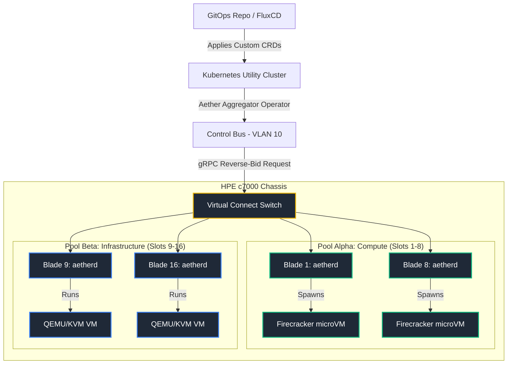
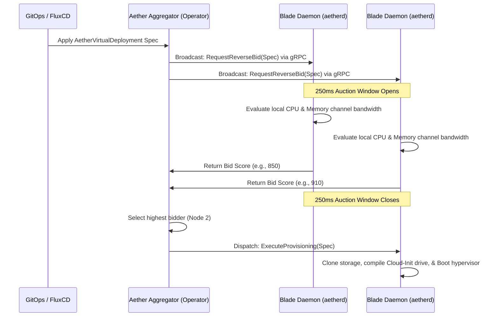

# Project Aether

### Autonomous, decentralized, multi-tenant compute — a pure-Linux replacement for VMware.

[](https://opensource.org/licenses/Apache-2.0)
[](https://www.rust-lang.org/)
[](https://firecracker-microvm.github.io/)
[](#delivery-stages--product-roadmap)

**Aether turns an enterprise blade chassis — such as an HPE BladeSystem c7000 — into a dense, multi-tenant private cloud, with no proprietary management stack.** It replaces VMware vCenter and vSphere DRS with a zero-dependency control plane written in Rust, built on a decentralized **Reverse-Bidding Architecture** that delivers "just enough orchestration" at sub-100ms boot times and near-zero hypervisor overhead.

Where VMware centralizes scheduling in a heavyweight, license-locked server, Aether pushes the decision to the edge: every blade bids for the workloads it can run best, and the winner boots the VM. No central master. No stale global database. No nested-virtualization tax.

---

## Why Aether

Enterprise virtualization is expensive, opaque, and centralized. A single vCenter outage can freeze an entire fleet, DRS decisions lean on a database that is always slightly out of date, and every feature sits behind a license. Aether is built on the opposite bet:

- **Decentralized by design.** Placement is a local decision made by each blade in a 250ms auction — there is no central scheduler to fall behind or fall over.
- **Pure Linux substrate.** Firecracker microVMs for high-density, ephemeral workloads; QEMU-KVM for long-lived, persistent VMs. No nested virtualization, no proprietary kernel modules.
- **Zero-dependency Rust.** A small set of statically-linked daemons (`unsafe` code is forbidden workspace-wide), not a sprawling Java/appliance estate.
- **GitOps as the source of truth.** Desired state lives in Kubernetes CRDs synced by FluxCD — the control plane itself is stateless and disposable.
- **Hardware-honest HA.** Failover uses out-of-band power fencing (STONITH) through the chassis management controller, not a software guess about whether a node is really dead.

### The VMware Replacement Matrix

Aether replaces heavy, stateful proprietary components with lightweight, stateless, decentralized open-source equivalents:

| Legacy VMware Component | Aether Open-Source Replacement |
| :--- | :--- |
| **vCenter Server** | Stateless Kubernetes Operator synced via **FluxCD** (GitOps-driven) |
| **vSphere DRS** | Autonomous, decentralized **gRPC Reverse-Bidding**, calculated locally on each blade |
| **vSphere HA** | Out-of-band hard-power fencing (STONITH) via the **HPE iLO 5 Redfish API** |
| **vSphere Distributed Switch** | Physical partitioning via **HPE Virtual Connect Flex-10 MLAG** & native Linux bridges |
| **VMware VMFS / vSAN** | Local **ZFS on Linux (ZoL) Volumes (ZVOLs)** & thin-provisioned LVM pools |

---

## Project Status

Aether is under **active development**, and the foundational layers already run under test:

- ✅ **Working today:** the mTLS-secured gRPC substrate, the reverse-bidding auction engine, the deterministic tie-breaker, and both hypervisor drivers (QEMU-KVM is the more mature; Firecracker builds and boots). Backed by **152 passing tests** across four crates at **~87% line coverage**.
- 🚧 **In active build-out:** storage slicing (ZFS/iSCSI/CSI), live migration (the migration socket is complete; block/memory transfer are being hardened), and network tagging.
- 🗺️ **On the roadmap:** out-of-band fencing & HA, the developer CLI and guest operations, multi-vendor hardware abstraction, and Cluster API integration.

See [Delivery Stages & Product Roadmap](#delivery-stages--product-roadmap) for the detailed picture.

---

## How It Works

### Cluster architecture

Aether splits a physical blade chassis (e.g., 16 slots, 640 CPU cores, 4 TB RAM) into two logical pools, each running a minimal bare-metal Linux install and the `aetherd` node daemon:



**Pool Alpha — Compute Blades (Slots 1–8)**
Ephemeral developer micro-environments, serverless functions, and high-density multi-tenant pods. `aetherd` uses **Firecracker** to spin up hardware-isolated microVMs directly on the bare-metal kernel in under 100 milliseconds, with less than 5 MB of memory overhead per instance.

**Pool Beta — Storage & Infrastructure Blades (Slots 9–16)**
Long-lived persistent VMs, production database replicas, and Kubernetes control/worker nodes. These blades run full **QEMU-KVM** and back block storage with **ZFS on Linux (ZVOLs)**, enabling inline compression, thin provisioning, and near-instant atomic snapshot cloning.

> **Topology note:** coordination is a *star*, not a mesh. Each `aetherd` holds a single mTLS gRPC channel to the Aggregator — there is no Raft, no gossip, and no quorum between blades. The only blade-to-blade traffic is live migration between a specific source and target.

### The reverse-bidding loop

Instead of a central scheduler pushing workloads onto nodes from a stale global view, Aether runs a decentralized, **pull-based marketplace**:



1. **Workload intent broadcast.** The Aggregator receives a declarative request via GitOps and broadcasts the spec (CPU quotas, memory bytes, storage boundaries, tenant mappings) to all registered blade daemons over secure gRPC.
2. **Autonomous telemetry evaluation.** Each blade queries its local kernel parameters — CPU task congestion, memory channel bandwidth, and drive wear leveling.
3. **The reverse-bid response.** Nodes compute a score from 1 to 1000, returning `-1` if they cannot safely host the instance without degrading current SLAs. Healthy nodes respond inside a strict **250ms convergence window**.
4. **Deterministic convergence.** The Aggregator accepts the highest bid. On ties, a multi-tier tie-breaker (chassis thermal layout, adjacent-slot density, SSD write wear) picks a winner deterministically. The winning node clones its local volume, compiles a NoCloud Cloud-Init drive in memory, and boots the hypervisor.

---

## Quickstart

Aether is a Cargo workspace and uses [`just`](https://github.com/casey/just) as a task runner.

```bash
# Build the entire workspace
cargo build --workspace

# Run the full test suite
just test            # cargo test -- --nocapture
just nt              # cargo nextest run (faster, parallel)

# Lint / pre-commit checks (rustfmt, clippy, ruff, mypy)
just setup-hooks     # one-time: install pre-commit hooks
just qa              # run all checks across the repo

# Coverage report (tarpaulin + markdown + threshold)
just coverage
```

---

## Repository Layout

The workspace is composed of five crates:

| Crate | Role |
| :--- | :--- |
| [`aetherd`](./crates/aetherd) | The per-blade node daemon: hypervisor drivers (Firecracker + QEMU), storage (ZFS/iSCSI), Linux-bridge networking, live migration, Cloud-Init, telemetry, VSOCK, and the local bidding algorithm. |
| [`aether-aggregator`](./crates/aether-aggregator) | The stateless Kubernetes operator: node registry, bid scheduler, deterministic tie-breaker, CSI storage driver, and HPE Virtual Connect networking. |
| [`aether-auth`](./crates/aether-auth) | Shared mTLS handshakes and single-use ephemeral attestation tokens. |
| [`aether-fence`](./crates/aether-fence) | Out-of-band STONITH fencing via the iLO 5 Redfish API *(planned — see Stage 6)*. |
| [`pact-mock-server`](./crates/pact-mock-server) | Contract-test mock server for validating gRPC API boundaries. |

gRPC contracts live in [`proto/`](./proto); design documents live in [`docs/`](./docs).

---

## Delivery Stages & Product Roadmap

The programme is organized into incremental stages that safely migrate a fleet off VMware:

```
[ Stage 1: API & Proto ] ──► [ Stage 2: Auction loop ] ──► [ Stage 3: Dual Hypervisor ]
                                                                     │
┌────────────────────────────────────────────────────────────────────┘
▼
[ Stage 4: ZFS & VC HAL ] ──► [ Stage 5: Live Migration ] ──► [ Stage 6: iLO Fencing / HA ]
                                                                     │
┌────────────────────────────────────────────────────────────────────┘
▼
[ Stage 7: Dev CLI & Vsock ] ─► [ Stage 8: Multi-Vendor HAL ] ─► [ Stage 9: Cluster API (CAPI) ]
```

### 🟩 Stage 1 — Core API & Rust Substrate *(Active)*
- Compile-target gRPC schemas under [`aether.proto`](./proto/aether.proto).
- Cargo workspace layout (Aggregator, Daemon, Auth, Fencing).
- Baseline Mutual TLS (mTLS) socket handshakes.

### 🟩 Stage 2 — Stateless Reverse-Bidding & Scheduling *(Active)*
- In-memory `NodeRegistry` and `WorkloadPlacement` state tables in the Aggregator.
- Asynchronous 250ms broadcast bidding convergence loop.
- Local host telemetry checks in `aetherd` (CPU loadavg, memory channel pressure).

### 🟦 Stage 3 — Dual Hypervisor Engine *(In Progress)*
- Firecracker boot loops in `aetherd` (VSOCK config, serial console routing).
- KVM management via raw QEMU command compilation.
- Dynamic `NoCloud` Cloud-Init compilation in host memory (`tmpfs`).

### 🟦 Stage 4 — Storage Slicing & Net Tagging *(In Progress)*
- Local **ZFS on Linux (ZVOL)** snapshot cloning with near-instant provisioning.
- `democratic-csi` integration for Kubernetes persistent storage.
- Virtual Connect Flex-10 hardware VLAN trunk tagging.

### 🟦 Stage 5 — Live Migration & Auto-Convergence *(In Progress)*
- **QEMU `drive-mirror` + NBD** block replication for local disk migrations.
- Iterative memory pre-copy over TCP migration sockets.
- Auto-Converge vCPU throttling to guarantee convergence under active write loads.

### ░░ Stage 6 — Out-of-Band Fencing & HA *(Planned)*
- Redfish STONITH client (`aether-fence`) targeting HPE iLO 5 endpoints.
- Stateless HA deadman-switch loop (15s heartbeat-timeout failover).
- ZFS asynchronous volume replication (`zrepl`) for DR (RPO 5m).

### ░░ Stage 7 — Developer CLI & Guest Operations *(Planned)*
- The `aether` developer CLI client.
- Zero-network guest access (`aether shell` / `aether exec`) via QEMU Guest Agent sockets and Firecracker VSOCK.
- Local directory passthrough via **VirtioFS**.

### ░░ Stage 8 — Multi-Vendor Hardware Abstraction *(Planned)*
- Abstract `ChassisManager` and `MidplaneNetworkManager` interfaces for Dell PowerEdge MX7000 and IBM/Lenovo Flex chassis.

### ░░ Stage 9 — Cluster API (CAPI) Integration *(Planned)*
- Kubernetes-native Cluster API provider (`cluster-api-provider-aether`) reconciling `AetherMachine` resources via `AetherVirtualDeployment` CRDs.
- Expose blade slots as native `FailureDomains` inside `AetherCluster` for CAPI node distribution.
- Dynamic IP discovery via DHCP snooping and QEMU Guest Agent queries.

---

## Further Reading

- [ARCHITECTURE.md](./ARCHITECTURE.md) — deep-dive system module structures and traits.
- [flintlock_contracts.md](./docs/architecture/flintlock_contracts.md) — VM specification API boundaries.
- [capi_compatibility.md](./docs/architecture/capi_compatibility.md) — Cluster API integration design.
- [distributed_proposals.md](./docs/architecture/distributed_proposals.md) — consensus, failover, and log compaction rules.
- [proxmox_features.md](./docs/architecture/proxmox_features.md) — comparative analysis with Proxmox VE and PDM.
- [live_migration.md](./docs/architecture/live_migration.md) — KVM memory and block live-migration protocols.
- [production_readiness.md](./docs/architecture/production_readiness.md) — DR, overcommit, secrets, and cache policies.
- [CONTRIBUTING.md](./CONTRIBUTING.md) — how to get involved.

---

*Licensed under [Apache 2.0](https://opensource.org/licenses/Apache-2.0).*
