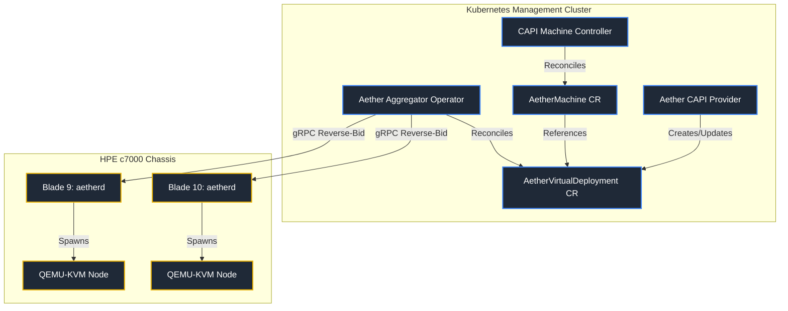
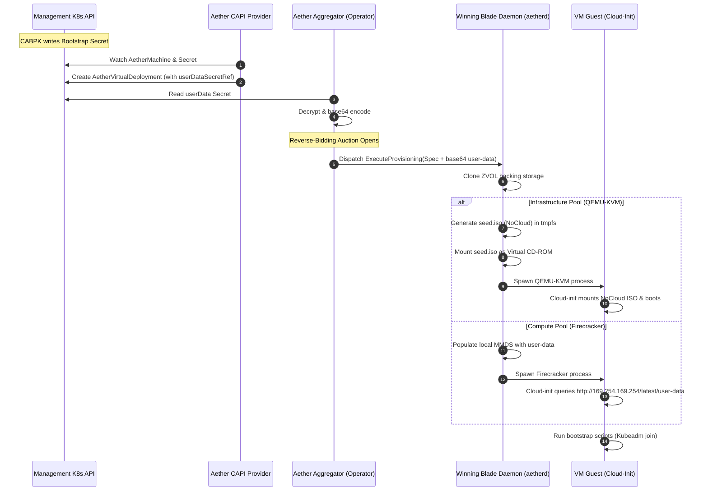

# Project Aether: Cluster API (CAPI) Compatibility Specification

This document details the architectural specifications and API contracts required to support a future **Cluster API (CAPI) Infrastructure Provider** (`cluster-api-provider-aether`). 

By designing these boundaries upfront, we ensure that Project Aether exposes all necessary lifecycle hooks, bootstrap configurations, failure domains, and network reporting interfaces to serve as a declarative Kubernetes infrastructure target.

---

## 1. Integration Model: K8s-Native vs. Direct Host

Traditional CAPI providers for hypervisors (like `cluster-api-provider-microvm` targeting Flintlock) often establish direct gRPC connections from the management cluster to individual hypervisor hosts. This requires the CAPI controller to handle VM scheduling, basic authentication secrets, and TLS configs for every host.

Aether adopts a **Kubernetes-Native Integration Model** where the future CAPI provider interacts exclusively with Aether's centralized Custom Resource Definitions (CRDs) on the utility/management cluster.



### Benefits of the Aether Model:
1. **Unified Scheduling:** CAPI does not need to choose which blade host a VM runs on. The Aether Aggregator's **Reverse-Bidding Marketplace** handles placement dynamically.
2. **Simplified Security:** The CAPI provider only needs local RBAC permissions to read and write Aether CRDs. It does not need access to node-level credentials or private control VLANs.
3. **Decoupled Hardware HAL:** Power fencing (STONITH) via HPE iLO 5 and midplane network VLAN tagging via HPE Virtual Connect are completely handled by the Aggregator.

---

## 2. API Contract Specification (`AetherVirtualDeployment`)

To support CAPI machine provisioning, the `AetherVirtualDeployment` CRD must expose specific fields in its `Spec` and `Status` blocks.

### A. Spec Schema

```yaml
apiVersion: compute.aether.infra/v1alpha1
kind: AetherVirtualDeployment
metadata:
  name: aether-control-plane-01
  namespace: default
spec:
  # Association with a tenant account
  tenantRef:
    name: tenant-system-prod
    
  # Compute Resource Allocation
  cpu:
    cores: 4
    pinning: false  # Optional CPU pinning for critical workloads
  memory:
    sizeInMb: 8192
    overcommitAllowed: true

  # OS Backing Store
  rootVolume:
    templateImage: "ubuntu-2204-minimal-zfs:v1.0.0"
    sizeInGb: 50
    storagePool: "infra-zpool"  # Targeted to slots 9-16 (Infrastructure)

  # Additional ZFS Persistent Block Devices
  additionalVolumes:
    - name: var-lib-etcd
      sizeInGb: 20
      mountPoint: "/var/lib/etcd"

  # Network Interface Tagging
  interfaces:
    - deviceId: eth0
      vlanId: 100       # Target tenant VLAN, provisioned via Virtual Connect
      guestMac: "52:54:00:12:34:56" # Optional static MAC, otherwise autogenerated
      ipConfig:
        mode: DHCP      # Or Static (CIDR, Gateway, Nameservers)

  # CAPI Bootstrap Injection (Cloud-Init)
  userDataSecretRef:
    name: control-plane-01-bootstrap-data # Reference to secret holding CABPK script
    key: value

  # Failure Domain Placement Hint
  failureDomain: "slot-9" # Target slot mapping (optional)
```

### B. Status Schema

```yaml
status:
  # Current lifecycle phase: Pending, Bidding, Provisioning, Running, Failed, Terminating
  phase: Running
  
  # Ready is set to true when the hypervisor process is running and the guest IP is reported
  ready: true
  
  # The physical blade that won the auction and is hosting the VM
  activeHostNode: "blade-09"
  
  # Unique URI scheme serving as the CAPI ProviderID (e.g. aether://<node-name>/<vm-uid>)
  providerID: "aether://blade-09/49c5e31e-4df7-4638-9cf2-9e8cbb6231bd"
  
  # List of resolved guest addresses required by CAPI to configure nodes
  addresses:
    - type: InternalIP
      address: "10.100.12.34"
    - type: Hostname
      address: "aether-control-plane-01"

  # Terminal error propagation
  failureReason: "VMBootFailure"
  failureMessage: "Failed to mount seed.iso drive: device timeout"
  
  conditions:
    - type: Ready
      status: "True"
      lastTransitionTime: "2026-06-29T13:30:00Z"
    - type: BiddingConverged
      status: "True"
      lastTransitionTime: "2026-06-29T13:29:45Z"
    - type: VolumeCloned
      status: "True"
      lastTransitionTime: "2026-06-29T13:29:50Z"
```

---

## 3. The Bootstrapping & Cloud-Init Delivery Pipeline

Cluster API depends heavily on injecting bootstrap configurations (usually generated by the Kubeadm Bootstrap Provider - CABPK) to initialize the Kubernetes control plane or join worker nodes.

The sequence below outlines how these secrets are securely decrypted, passed through the bidding process, and loaded into the VM guest:



---

## 4. Network IP Address Discovery

CAPI controllers require the IP address of the provisioned node to verify cluster integration. Because nodes can use DHCP or dynamic setups, Aether implements three discovery routes to populate `Status.Addresses`:

### A. Static Specifications (Fallback)
If static configuration is requested in `interfaces[*].ipConfig`, the Aggregator immediately sets this address in the status.

### B. DHCP Lease Snooping
For Compute blades running Firecracker microVMs on local tenant bridges, `aetherd` monitors the midplane DHCP lease file or listens to ARP broadcast packages on the host-side Linux bridge (`br-tenant`). When a MAC matches the guest's interface, `aetherd` writes the leased IP to the local daemon state.

### C. QEMU Guest Agent (Infrastructure Pool)
For long-lived persistent VMs running on QEMU-KVM:
1. Aether bundles the `qemu-guest-agent` into all default base templates.
2. The virtual machine definition configures a virtio-serial channel:
   ```xml
   <channel type='unix'>
     <source mode='bind' path='/var/run/qemu/aether-vm-01.agent'/>
     <target type='virtio' name='org.qemu.guest_agent.0'/>
   </channel>
   ```
3. Once the guest OS boots and starts the agent daemon, the host `aetherd` polls the socket using QMP commands:
   ```json
   { "execute": "guest-network-get-interfaces" }
   ```
4. This command returns the guest's active IPv4 and IPv6 allocations, which `aetherd` immediately reports back to the central Aggregator.

---

## 5. Exposing Failure Domains

To enable Kubernetes high availability, Cluster API allows machine deployments to target specific physical locations—known as **Failure Domains**. 

Aether exposes the physical layout of the HPE blade chassis as Failure Domains in the `AetherCluster` status:

```yaml
status:
  failureDomains:
    slot-09:
      controlPlane: true
      attributes:
        pool: "Infrastructure"
        chassis: "chassis-prod-01"
        powerBMC: "10.99.9.9"
    slot-10:
      controlPlane: true
      attributes:
        pool: "Infrastructure"
        chassis: "chassis-prod-01"
        powerBMC: "10.99.9.10"
    slot-01:
      controlPlane: false
      attributes:
        pool: "Compute"
        chassis: "chassis-prod-01"
        powerBMC: "10.99.9.1"
```

*   **Bidding Constraints:** When CAPI schedules an `AetherMachine` with a specific `FailureDomain` constraint (e.g., `slot-09`), the Aether Aggregator limits the reverse-bid broadcast strictly to the target blade. If the target blade is offline, the auction fails, ensuring CAPI maintains deterministic topology constraints.
